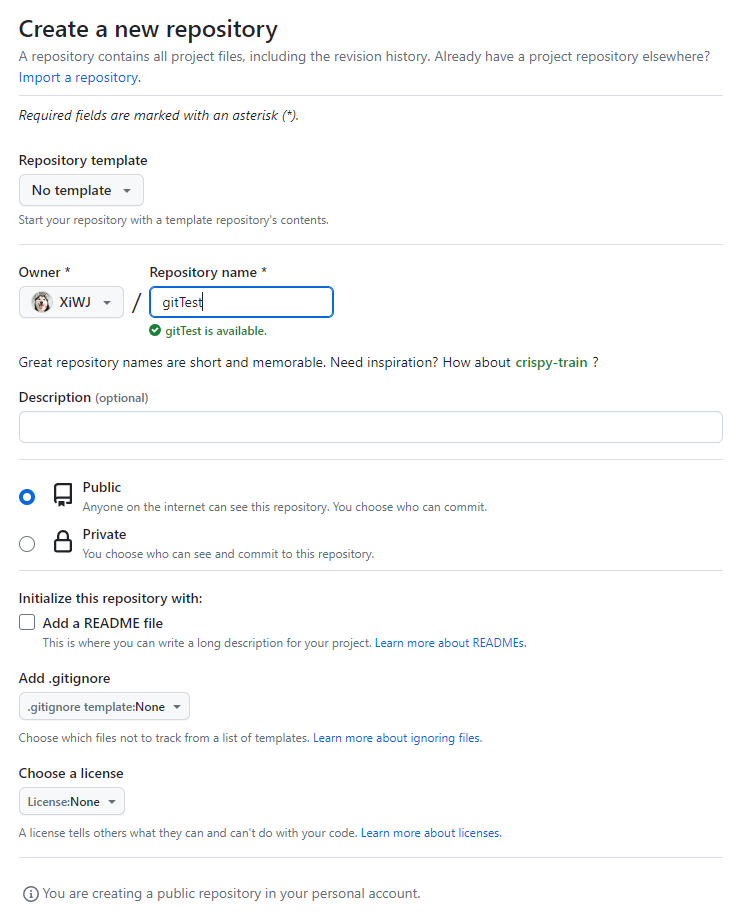

# Test git
## 创建git仓库

```
git config --global user.name "xxxx"
git config --global user.email "xxxx@emal.com"
git init
git add .
git commit -m "first commit"
git branch -M develop
git remote add origin https://github.com/xxxx/YYYY.git
git push -u origin develop
```

## 开发并合并
```
git pull
git add .
git commit -m "add testA.py"
git push
```